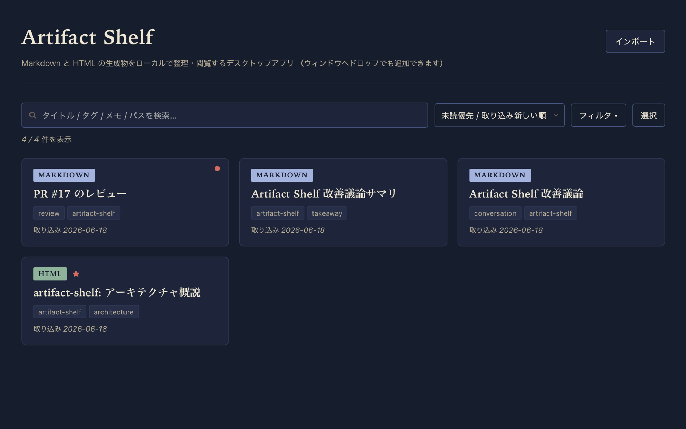
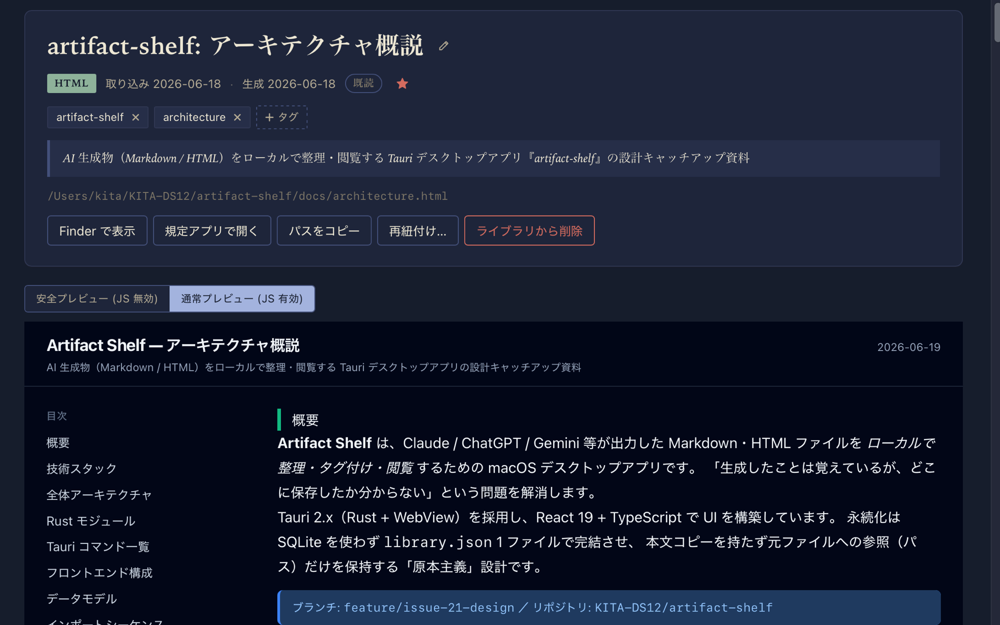

# Yomikura （読み蔵）

[](https://github.com/KITA-DS12/yomikura/actions/workflows/ci.yml)
[](LICENSE)

Markdown と HTML の AI 生成物を、ローカルで整理・閲覧する **書庫風** デスクトップアプリ。「生成したことは覚えているが、どこに置いたか分からない」を解消します。



## 特徴

**1. ローカルで完結する**
クラウド・アカウント・サーバー不要。データは `library.json` 1 ファイルに収まり、原本は元のファイルのまま手元に置いておけます（アプリは参照だけを持ち、本文はコピーしません）。

**2. Markdown / HTML を素のまま読める**
シンタックスハイライト、GFM、目次ジャンプに対応。HTML は sandbox iframe で安全にプレビューし、本文の高さに合わせて流れるように表示します。



**3. タイトル・タグ・メモで素早く見つけ直す**
全件を横断する検索、フィルタ（種別 / 既読 / お気に入り / 取り込み日 / タグ）、複数のソート。気づいたタグやメモはその場でクリックして編集できます。

**4. 元ファイルへ戻れる**
Finder で表示 / 規定アプリで開く / パスをコピー / 移動した場合の再紐付け。ライブラリから削除しても元ファイル自体は触りません。

## 主な使い方

- Claude / ChatGPT に作らせたレビュー結果やリポジトリ可視化 HTML を蓄積する
- 設計メモ・仕様書を Markdown で整理する
- タグや日付から過去の生成物を探し直す

## ダウンロード

[Releases ページ](https://github.com/KITA-DS12/yomikura/releases) から OS に対応したインストーラをダウンロードしてください。

### macOS

- Apple Silicon: `Yomikura_<version>_aarch64.dmg`
- Intel Mac: `Yomikura_<version>_x64.dmg`

インストール:

1. `.dmg` をダブルクリックで開く
2. `Yomikura.app` を Applications フォルダにドラッグ
3. **初回のみ、ターミナルで quarantine 属性を外す**:
   ```sh
   xattr -dr com.apple.quarantine /Applications/Yomikura.app
   ```
4. Launchpad / Spotlight / Finder から `Yomikura` を起動
5. 起動時に **「マルウェア検証ができませんでした」** と出たら:
   1. ダイアログを閉じる（「キャンセル」or「ゴミ箱に入れる」を選ばない、閉じるだけ）
   2. **システム設定 → プライバシーとセキュリティ** を開き、画面を下までスクロール
   3. 「`Yomikura.app` は識別された開発元からのものではないためブロックされました」の右の **「このまま開く」** をクリック
   4. パスワード / Touch ID で認証
   5. もう一度 Yomikura を起動 → 警告ダイアログの **「開く」** を選択
   6. 以降は普通に起動できる

> **なぜこの手順が必要?**
> Apple Developer Program（年額契約）に未加入のため、Apple の公証チェックを通っていません。macOS Big Sur 以降の Gatekeeper は未公証アプリを強くブロックするので、上の 2 段階で「自分で確認した上で許可」する必要があります。
>
> - `.dmg` 由来の \`com.apple.quarantine\` 属性 → 「壊れているため開けません」 → **手順 3 の `xattr -dr`** で解除
> - 公証なしによる Gatekeeper のブロック → 「マルウェア検証できませんでした」 → **手順 5 のシステム設定** で許可

### Windows

- `Yomikura_<version>_x64_en-US.msi` または `Yomikura_<version>_x64-setup.exe`

インストール:

1. ダウンロードした `.msi` または `.exe` を実行
2. インストーラの指示に従う

> Microsoft Defender SmartScreen の警告が出る場合は「詳細情報」→「実行」で進めてください（コード署名なしのため）。

## 技術構成

- Tauri 2.x（Rust + WebView）
- React 19 + TypeScript + Vite
- 永続化: JSON ファイル
  - macOS: `~/Library/Application Support/com.kita.yomikura/library.json`
  - Windows: `%APPDATA%\com.kita.yomikura\library.json`
- テスト: Vitest + React Testing Library / Rust 単体テスト

> 旧名 `Artifact Shelf`（`com.kita.artifact-shelf`）からの初回起動時、旧パスに `library.json` があれば新パスに自動コピーします（旧側は残ります）。

## 開発

### 必要なツール

- Node.js 22 以上
- Rust 1.80 以上
- Tauri 2 のシステム要件: https://v2.tauri.app/start/prerequisites/

### 起動

```sh
npm install
npm run tauri dev
```

### テスト

```sh
# フロント側
npm run test

# Rust 側
npm run test:rust
```

### ビルド（ローカル）

```sh
npm run tauri build
```

成果物は `src-tauri/target/release/bundle/` に出力される。

## リリース（メンテナ向け）

`vX.Y.Z` の Git タグを push すると、GitHub Actions が macOS（Apple Silicon / Intel）と Windows (x64) 向けのインストーラを自動ビルドし Draft Release にアップロードする。

```sh
git tag v0.3.0
git push origin v0.3.0
```

完走後、Releases ページの Draft を確認して Publish する。

## 現時点で対応しないこと

このアプリは個人利用 MVP として運用しています。以下は **意図的に対象外** とし、必要になった時点で個別に判断します（書庫の本懐は「過去の生成物を壊さず見つけ直せる」ことなので、不可逆な作り込みを増やすより、消せる状態を維持することを優先しています）。

- **Apple Developer 署名・公証 / Windows コード署名**: 初回起動時の警告は許容し、年額契約はしない
- **auto-updater**: GitHub Releases からの手動入れ替えで十分
- **Linux ビルド**: 必要になってから tauri-action の matrix を増やす
- **E2E テスト**: Vitest + `cargo test` の範囲で十分なスコープ
- **仮想スクロール / 全文検索インデックス**: 件数が増えてから（現状 1ms 未満で十分捌ける想定）
- **タグの rename / マージ UI**: タグ運用が定着してから判断
- **クラウド同期**: ローカル完結が魅力なので導入しない

これらは「やらないことを宣言しておく」目的で書いており、要望や状況の変化で個別に Issue を切って復活させる前提です。

## ライセンス

[MIT](LICENSE) © 2026 KITA-DS12
